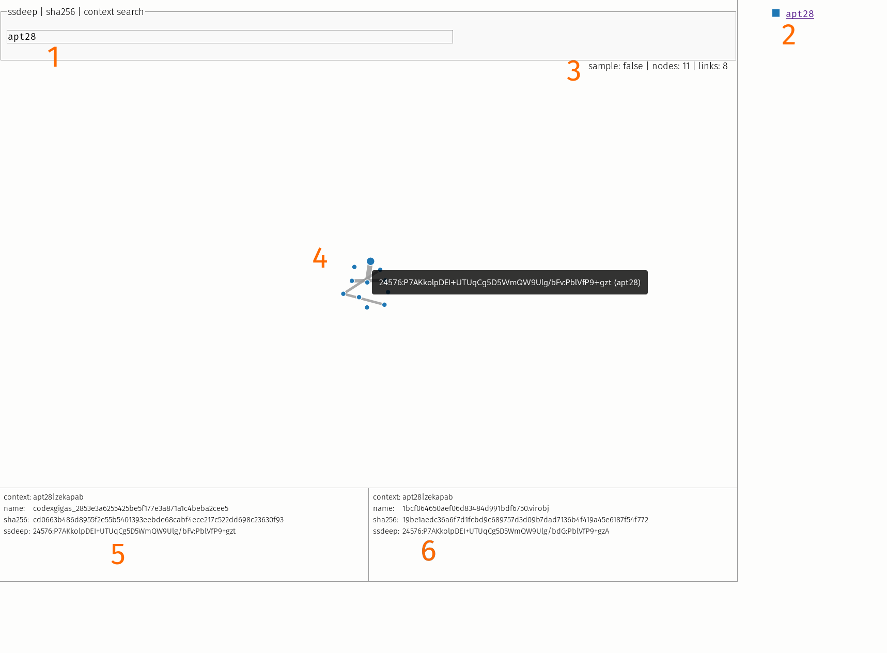

# ssdeep correlation with kathe

## kathe.py

`kathe.py` stores ssdeep hashes in Redis in such a way that correlation (ssdeep compares) between all relevant hashes is possible. Because the comparison is done during storage, retrieving all similar ssdeep hashes later is cheap.

`kathe.py` also stores cross-linked info to redis: any of filename, ssdeep, sha256 and context has pointers to the other info available.

Additionally, unique lists of sha256 hashes, ssdeep hashes, filenames and contexts are created. These lists function as "Indeces" which can help you access all data. The names:context list is stored as a sorted set (zset). The score is a counter of occurrence of a context value. Besides the obvious benefit of knowing the size of each stored context group, the zset also serves as a numbered dictionary in `app.py`.

```
(set) names:sha256
(set) names:ssdeep
(set) names:filename
(zset) names:context
```

Besides the rolling_window keys, which you probably won't need, there are four additional key types you could use:

```
info:filename:<filename>
info:sha256:<sha256>
info:ssdeep:<ssdeep>
info:context:<context>
```

 Please be aware that `kathe.py` removes unwanted characters like non-utf8 and control characters from filenames and contexts. In addition the following characters (python list) are also removed:

```python
[':', '\\', '"', '\'', '|', ' ', '/']

```

The real magic of kathe.py is hidden behind the sorted sets (zset) with the name `<ssdeep hash>`. The  score redis associated with every value in the zset, holds the result of a `ssdeep_compare` between the "parent" ssdeep and any partially similar sddeep hashes I've named "siblings".

## Accessing lists of all sha256/filename/ssdeep/context stored:


### sha256 hashes

To get a list of all sha256 hashes of all stored info:

```bash
smembers hashes:sha256
```

To get a list of all ssdeep hashes of all stored info:

```bash
smembers hashes:ssdeep
```

To get a list of all filenames of all stored info:

```bash
smembers names:filename
```

To get a list of all contexts of all stored info:

```bash
zrange names:contexts 0 -1
```

### Particular filename

A filename can be any arbitrary identifying string. In this example I'm using a small sample set of the zekapab malware. Please feel free to abuse this field for any arbitrary identifying string.

To get information on a filename:

```bash
smembers info:filename:<filename stripped of "badchars", see above>
```

As nearly identical files can potentially have the same ssdeep hash, this might return a number of (unique)
results. Format of the response:

```bash
smembers info:filename:binary-147-meta.exe
1) "sha256:ca8bdaa271083cff19b98c3a46a75bc4f6d24ea483b1e296ad2647017a298e92:ssdeep:384:1gwH4hdaH5CLrowT7xprE4rUuUd989wRTp0W1u:V4XWuoUr8Hd989wRGW1u:context:apt28|zekapab"
```

#### Tip:

>  sha256 hashes always have the same format, so you can always access the ssdeep hash in the set by splitting on '`:`' and getting field **3,4,5** (counting from zero).

### Particular sha256 hash

To get information on a sha256 hash:

```bash
smembers info:sha256:<sha256 hash>
```

As identical files can have many names, this will possibly return a number of (unique) results. Format of the response:

```bash
smembers info:sha256:19be1aedc36a6f7d1fcbd9c689757d3d09b7dad7136b4f419a45e6187f54f772
1) "ssdeep:24576:P7AKkolpDEI+UTUqCg5D5WmQW9Ulg/bdG:PblVfP9+gzA:context:apt28|zekapab:filename:1bcf064650aef06d83484d991bdf6750.virobj"
```

#### Tip:

> Ssdeep strings always have the same format, so you can always access the filename in this string by splitting on '`:`' and getting field **5** (counting from zero).


### Particular ssdeep hash

To get information on a ssdeep hash:

```bash
smembers info:ssdeep:<ssdeep hash>
```

As nearly identical files can potentially have the same ssdeep hash, this might return a number of (unique)
results. Format of the response:

```bash
smembers info:ssdeep:24576:P7AKkolpDEI+UTUqCg5D5WmQW9Ulg/bdG:PblVfP9+gzA
1) "sha256:19be1aedc36a6f7d1fcbd9c689757d3d09b7dad7136b4f419a45e6187f54f772:context:apt28|zekapab:filename:1bcf064650aef06d83484d991bdf6750.virobj"
```

#### Tip:

>  sha256 hashes always have the same format, so you can always access the filename in this string by splitting on '`:`' and getting field **3** (counting from zero).

### Particular context

You will very likely want to know which files/ssdeeps/filenames appear in a certain context. That is why I added 'context' (and made it a **MUST**).

Access to all the info in a context is as simple as:

```bash
smembers info:context:apt28
 1) "sha256:e7dd9678b0a1c4881e80230ac716b21a41757648d71c538417755521438576f6:ssdeep:24576:ybvZoVeeYPVvwrWmQFVHaf9P3lgtgZBJJw0OXjCVmXw11:ya6VHal3lgtgPJJw0OXuAXwv:filename:codexgigas_b3086b4d99288d50585d4c07a3fdd0970a9843fc:filecontext:apt28|zekapab"
 2) "sha256:7<...>
```

## Workflows

### Workflow with a "json" line file


```bash
head -1 apt28/apt28.json 
["12288:25OuuqTt1WS36Lpvf9wScE1BR53LOvGV1Jww1nOXn+OCVOeXSVbHXwqdC1:25O6HVkpmSDBRBJJw0OXjCVmXw11", "12-033-1589(1).rar", "e53bd956c4ef79d54b4860e74c68e6d93a49008034afb42b092ea19344309914"]

cat apt28/apt28.json | while read line; do ./kathe.py -r 1 -c apt28,zap -j "${line}" ; done
```

### Workflow with files

I have added  the `malpedia.py script`  used below to the repository. Although specifically designed for working with @malpedia, it can possibly help to get started if you want to parse other repositories. The malpedia script adds the required `-c malpedia` context variable (because I'm lazy).

```bash
#!/usr/bin/env bash
# using db 13 for testing
./malpedia.py | while read line; do echo "${line}" && ./kathe.py -r 13 ${line};done
```

# App.py web gui

After initially working with the "raw" data in redis and some graphviz, I've found that working with an interactive gui is very handy. So I've made app.py, a python-bottle web application. Please keep in mind that I am in no way a gui expert or web application developer. The following python libraries are required:

- bottle
- json
- math
- urllib.parse
- ast
- bottle_redis

The app is designed to work *offline*, so from javascript to fonts, everything is bundled locally.

Just unzip app.zip, get the required python modules and you are ready to start. The zip file contains a README.md with instructions on how to set it up with uwsgi, but for day-to-day activities you can just run `./app.py` and work from there.




A quick tour to help you get started:

1. Fill in a (large) context to get you started if you just want to look around. Or a sha256 or ssdeep hash if you want to focus on a particular thing.
2. All primary contexts of all nodes are listed here. If an element has multiple primary contexts (say you added a piece of malware with *apt28* as primary context, but added the same (or nearly the same) malware under the *Sofacy* name, it will show up here as a unique group called apt28/sofacy).
3. If this says "`sample: true`" the number of associated nodes has reached it's max and the dataset has been truncated. What the max is can be adjusted in `app.py`.
4. The view can be zoomed/ panned and nodes can be clicked, in which case the related edges show up. Hovering over a node shows the ssddeep hash and context, hovering over an edge the ssdeep similarity score. Clicking on the background removes the focus from the clicked node. One TODO left is thinking of a way to z-index the edges up.
5. If you hover over a node the left infopanel shows the details of that node.
6. IF you click on a node the right infopanel shows the details of the clicked node.